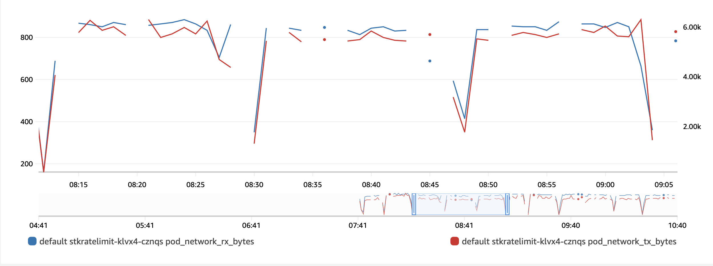

# Mitigating UDP flood attacks with Agones and iptables

We show how to minimize UDP flood attacks on dedicated game servers by limiting the game server lifespan and rate-limit players network ingress to the game server.
The sample shows an implementation of the Agones SDK including [Player Tracking](https://agones.dev/site/docs/guides/client-sdks/rest/#player-tracking). It also demonstrates how to rate-limit ingress to the game-server using iptables rules. 

### How to use this sample?
* [Build the game server image from source, create a k8s cluster on EKS, deploy Karpenter for hosting game-servers, legitimate and attacker bots applications](../supertuxkart#mitigate-udp-flood-with-agones-iptables)
* We will deploy three Karpenter provisioners for hosting the game server, the player bots and attacker bots because we want to simulate real scenario where traffic to game-servers originates from different nodes. i.e., game server deployed on nodes that labeled with `karpenter.sh/provisioner-name: stksrv`. legitimate bot players with `karpenter.sh/provisioner-name: stkbot`, and attacker bots with `karpenter.sh/provisioner-name: ddosbot`

```shell
cat ./stk-srv-provisioner.yaml | envsubst | kubectl apply -f -
cat ./stk-bot-provisioner.yaml | envsubst | kubectl apply -f -
cat ./ddos-bot-provisioner.yaml | envsubst | kubectl apply -f -
``` 
* Game clients that runs as bots in a k8s deployment requires to restart pods when the game session is over to simulate continuous game usage so we created a specific k8s service account that allows pods restart.

```shell
kubectl apply -f ./stk-role-sa.yaml
```
* Game clients discovers available game servers with a match-making service that uses Postgresql so both clients and servers requires access to match-making db service. Populate `db-creds.secrets` with your DB creds and create k8s secrets

```shell
./db-creds-create.sh
```

### Deploy the happy path - game server with no rate-limits
Deploy the vanilla game server and play the game with legitimate bots. The game servers are `"agones.dev/v1" Fleet` and the game bots are `apps/v1 Deployment`. The Agones SDK implementation includes [start-server.sh](../supertuxkart/server/stk-game-server-image-multiarch/start-server.sh) and [monitor-sessions.sh](../supertuxkart/server/stk-game-server-image-multiarch/monitor-sessions.sh) that runs in the background and monitors the game activities based on standard-output and standard-error traces. The main motivation for using Agones was to limit the game lifespan for the time players wish to play until they finish the game session. We also used Agones Player Tracking to control the number of players in a session to reduce flood attack impact as the game server will reject new connections beyond the server capacity. 

We first issue
```
curl -s -d "{}" -H "Content-Type: application/json" -X POST http://localhost:${AGONES_SDK_HTTP_PORT}/health
``` 
once the game engine is loaded. Then we check if the game lobby is ready to accept new players and report to Agones it is ready. 

```
ready_server=`cat $STDOUT| grep "ProtocolManager: A 11ServerLobby protocol has been started."`
  if [ ! -z "$ready_server" ]; then
    if [ "$is_ready" = "False" ]; then
      curl -s -d "{}" -H "Content-Type: application/json" -X POST http://localhost:${AGONES_SDK_HTTP_PORT}/ready
      is_ready="True"
    fi
  fi
```

The `monitor-sesssion` keeps looking for players activities `"STKPeer: sending packet of size .* to .* at .*"` and append log new players in Agonse:

First we transtion the game server state to `allocate` and then `/player/connect`.

```
conn_peer_list=`tail -40000 $STDOUT|grep  "STKPeer: sending packet of size .* to .* at .*"| awk '{print $10"-"$9}'| sed 's/:/C/g' | sed 's/\./D/g'`
  if [ ! -z "$conn_peer_list" ]; then
    curl -s -d "{}" -H "Content-Type: application/json" -X POST http://localhost:${AGONES_SDK_HTTP_PORT}/allocate
  fi
```
We also look for `STKHost:.* has just disconnected` for disconnected players to issue `/player/disconnect`

Finally, when the `/player/count` is 0, we send:
```
curl -d "{}" -H "Content-Type: application/json" -X POST http://localhost:${AGONES_SDK_HTTP_PORT}/shutdown
```
for Agones to recycle the game server.

Execute the following to see bot players play the game.

```shell
cat ./stk-srv-fleet.yaml | envsubst | kubectl apply -f -
cat ./stk-bot-deploy.yaml | envsubst | kubectl apply -f -
```

If you deployed Container Insights, look for the game server pod and view the network usage by the pod.

