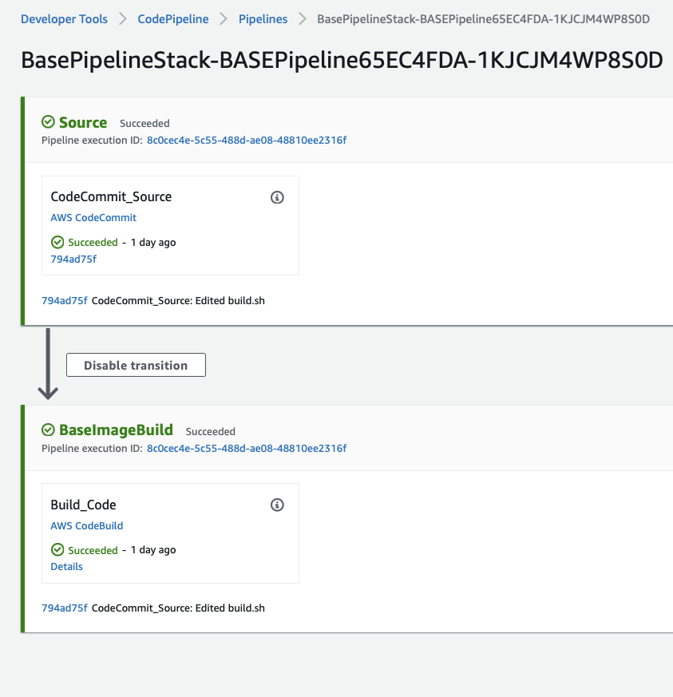
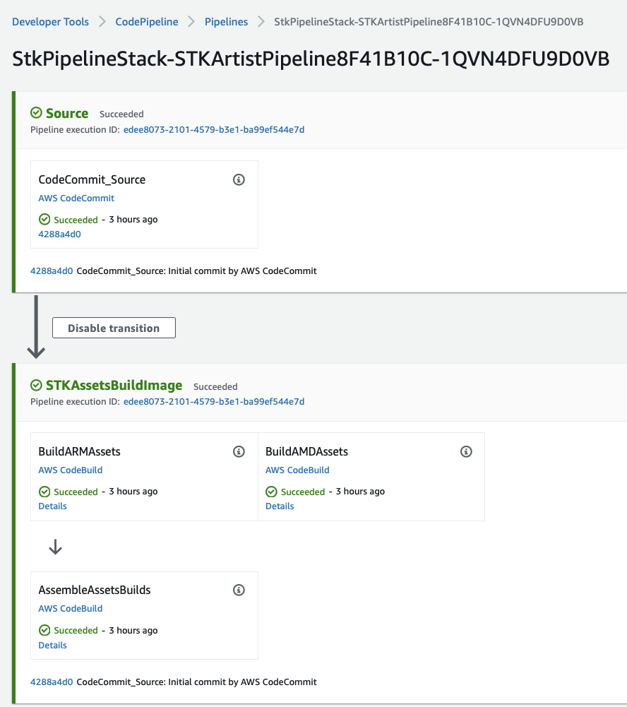
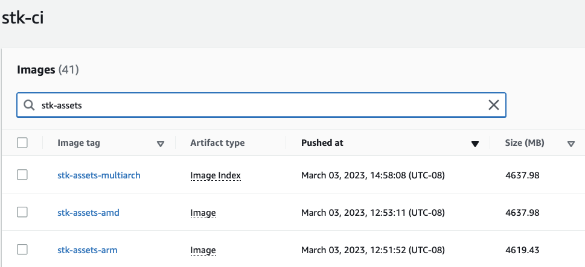
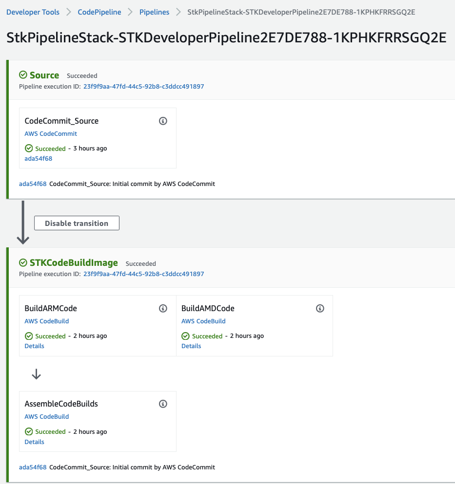
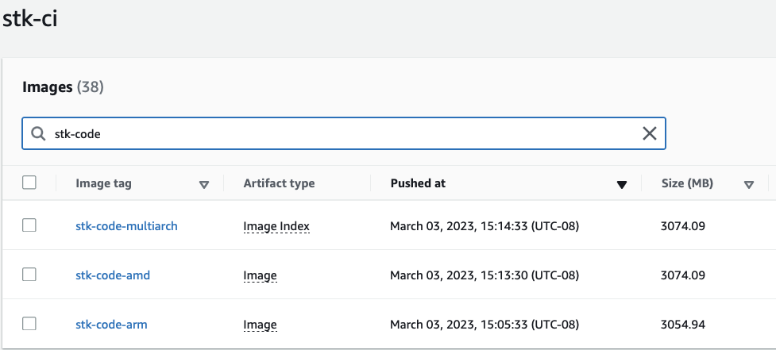
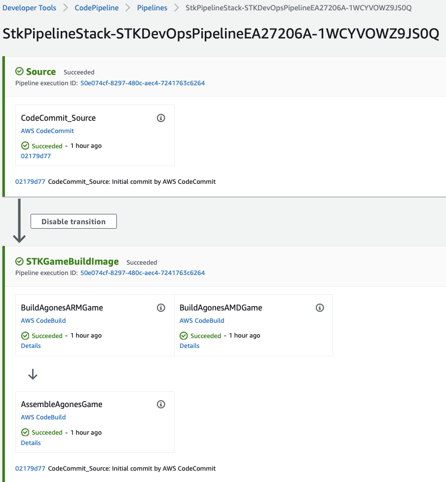

# A sandbox UDP multiplayer video game 

[AWS Developer Tools](https://aws.amazon.com/codepipeline/), [EKS](https://aws.amazon.com/eks/), and [Docker](https://www.docker.com) simplify integrating dedicated game server. Dedicated game servers require the game assets, binaries and management tools to be hosted on the same host that runs the game server, so they must be copied for each game server instance. Also, game assets and binaries can add up to gigabytes, slowing down game server initialization time. Causing players to wait and racking up expensive data transfer costs from the build system to the host that runs the server. 

The game server image size doubles when adding support for more processor types like [AWS Graviton processors](https://aws.amazon.com/ec2/graviton/), [Intel Xeon](https://aws.amazon.com/intel/) or [AMD EPYC processors](https://aws.amazon.com/ec2/amd/). Each processor type requires its own intergated game image. 

Furthermore, the game server components are owned by different teams which requires extra coordination during the game integration phase. For example, asset artists create graphics, 3D models, sound effects and music that might be required for the game binary compilation owned by the game developers. The game devops need the game binary to integrate it with an orchestration platform that matches players. 

In this sample we show how to minimize game integration time and costly data transfer between the build and the hosting systems. We do this by building images that support Intel and Graviton instances. We consider three main personas: artists, developers and devops. 

The artist manages the game assets and pushes them to the build system. The developer codes, tests the game and pushes their changes to the build system. Finally, devops implements SDK such as Agones on top of the game code and releases it the changes to the build system.

We use [Supertuxkart](https://supertuxkart.net/), a 3D open-source arcade racer with a variety of characters, tracks, and modes to play to demonstrate the game image integration process. We deploy separate integration pipelines for artists, developers and devops. This allows them to operate orthogannly and produce a single image that runs on any instance type that fits the game's needs. Each phase is controlled by a GIT repository that triggers the build phase upon pushing a new phase configuration. 

First pipeline owned by devops and it creates the base-image for the game hosting. Our example uses the [Python3.9](https://hub.docker.com/_/python) loaded on Amazon Linux-based image that supports ARM64v8 and AMD64 processor types. To utilize Docker image layer caching, the base-image build process installs the required packages such as the C++ compiler and network tools in the initial integration phase.  

The next pipeline is owned by the artists. It assumes the artist uses asset management tools and it copies the 1.4GB assets files to storage services such as SVN or S3. The artist pipeline pulls the assets files from S3, splits them into layers that are cached per CPU architecture. Game assets can be pulled dynamically during the next phase if they're not big. 

The third pipeline handles game binary compilation and linkage into a single executable. It uses the compiler and packages installed in the first stage and the assets that are referenced in the code for the build process.  

The last integration phase includes game management tools that connect with the game orchestration layer Agones that maintains the game server health, controll the player connectivity and more. 


## Manual deploy steps
Below is the sequence of manual execution steps for building a game docker image that runs on ARM64 and AMD64 CPU arch.We also offer automation with CodePipeline and CodeBuild in the next section

1/ Populate the following enviroment variables. 

```bash
export AWS_ACCOUNT_ID=$(aws sts get-caller-identity --output text --query Account)
export AWS_REGION=us-west-2
export BUILDX_VER=v0.10.3
export BASE_REPO=baseimage-ci
export BASE_IMAGE_TAG=multiarch-py3
export GAME_REPO=stk-ci
export GAME_ASSETS_TAG=stk-assets-multiarch
export GAME_ARM_ASSETS_TAG=stk-assets-arm
export GAME_AMD_ASSETS_TAG=stk-assets-amd
export GAME_ARM_CODE_TAG=stk-code-arm
export GAME_AMD_CODE_TAG=stk-code-amd
export GAME_CODE_TAG=stk-code-multiarch
export GAME_SERVER_TAG=stk-server-multiarch
export GAME_ARM_SERVER_TAG=stk-server-arm
export GAME_AMD_SERVER_TAG=stk-server-amd
export GITHUB_STK="https://github.com/yahavb/stk-code"
export GITHUB_STK_BRANCH=master
export SVN_STK="https://svn.code.sf.net/p/supertuxkart/code/stk-assets"
export S3_STK_ASSETS="supertuxkart-assets"

export INSTANCE_FAMILY=t4g
export CLUSTER_NAME=ddosudpsimu-us-west-2
```

2/ Build the base image

This is the image that includes the generic tools and libraries needed for the game. We used CPU architecture agnostic packages to allow dynamic compile and linkage to local architecture. The persona that most interested in this build is the IT/Devops that optimizes for stability and security

```bash
cd ./server/base-image-multiarch-python3
./buildx.sh
```

3/ Link the game assets 

This is the game images, video, and audio files. The persona that owns this step is the game artist. The media files (audio, images, and videos) can be stored on storage solutions such as SVN and S3. The original location for STK is https://github.com/supertuxkart/stk-assets-mobile/releases/download/git/stk-assets-full.zip but we copied it to S3 and broke it into 256MB pieces to allow optimized Docker layer cache.

```bash
cd ./server/stk-assets-image-multiarch
./buildx.sh
```

4/ Build the game binaries

Build the game executables. The persona that owns this is the game developer.

```bash
cd ./server/stk-code-image-multiarch
./buildx.sh
```

5/ Build the deployable game image

This is the game governance piece. It includes the scripts the controls the game lifecycle and the game ecosystem like matchmaking, leaderboard, and messaging applications. The persona that owns this step is the game live/devops team that operates the game.

```bash
cd ./server/stk-game-server-image-multiarch
./buildx.sh
```
## Automated deploy steps
The following will create a CodePipline that copy the build scripts in `server/` folder into a CodeCommit repository and run the steps above in a separate CodeBuild jobs.

1/ deploy the pipeline that creates the base image

```bash
./deploy-base-pipeline.sh
```

2/ deploy the pipeline that creates the stk image game

```bash
./deploy-stk-pipeline.sh
```

#### Base-image Pipeline

The Source stage includes the [code and config](./server/base-image-multiarch-python3/). Note the [Dockerfile](./server/base-image-multiarch-python3/Dockerfile) includes no processor architecture specific so the libraries and packages linked dynamically via the packaged tools e.g., `apt` or `yum`



The resulted images of the base-image pipeline are two images: a 601.11 MB (AMD64) and 582.56 MB (ARM64) docker images. 


#### Game Artist Pipeline

The source stage includes the [code and config](./server/stk-assets-image-multiarch/). Note the build process pulls six assets files from S3 (256MB each) and copy to `/stk-assets` sub-directory. The Dockerfile pre-processed with `envsubst` command for setting the enviroment variables. 



The resulted image of the developer pipeline are two images, `stk-assets-amd` 4637.98 for AMD64 and `stk-assets-arm` 4637.43 for ARM64 and Image Index. 



#### Game Developer Pipeline

The source stage includes the [code and config](./server/stk-code-image-multiarch/). 



We first copy the assets folder from the previous step.

```bash
FROM stk_base AS stk_code
	COPY --from=1 /stk-assets /stk-assets
```

Then we pull the code from a separate Git repository that compatible with the assets (`GITHUB_STK` and `GITHUB_STK_BRANCH`)

```bash
RUN git clone $GITHUB_STK stk-code --branch $GITHUB_STK_BRANCH && \
	    cd stk-code && \
	    mkdir cmake_build && \
	    cmake ../stk-code -B ./cmake_build -DSERVER_ONLY=ON && \
	    cd cmake_build && \
	    make -j$(nproc) -f ./Makefile install
```

The pipeline includes two identical build actions that runs on [ARM64](https://github.com/aws-samples/containerized-game-servers/blob/master/supertuxkart/stk-pipeline-stack.ts#L283) and [AMD64](https://github.com/aws-samples/containerized-game-servers/blob/master/supertuxkart/stk-pipeline-stack.ts#L318) instances. The third build action assembles the two images into a docker image index (manifest) by the [assemble_multiarch_image.sh](./server/stk-code-multiarch/assemble_multiarch_image.sh)

The resulted image of the developer pipeline are two images, `stk-code-amd` 3074.09 for AMD64 and `stk-code-arm` 3054.94 for ARM64 and Image Index. 



#### Game Devops Pipeline

The source stage includes the [code and config](./server/stk-game-server-image-multiarch/). 



Note that this step pulls only the compiled code produced by the game developer pipeline and the assets from the game artist pipeline.

```bash
FROM stk_base AS stk_game
COPY --from=1 /stk-assets /stk-assets
COPY --from=2 /stk-code /stk-code
```

and add to oit the [STK Agones SDK implementation](./server/stk-game-server-image-multiarch/). Like in previous steps, it runs two separete `docker build` jobs (2360.44 MB for AMD64 and 2341.56 MB for ARM64) that are assembled into a docker index image, `stk-server-multiarch`. 


Note that each pipeline phase is optimized for storage to avoid long replication time to the cluster. 