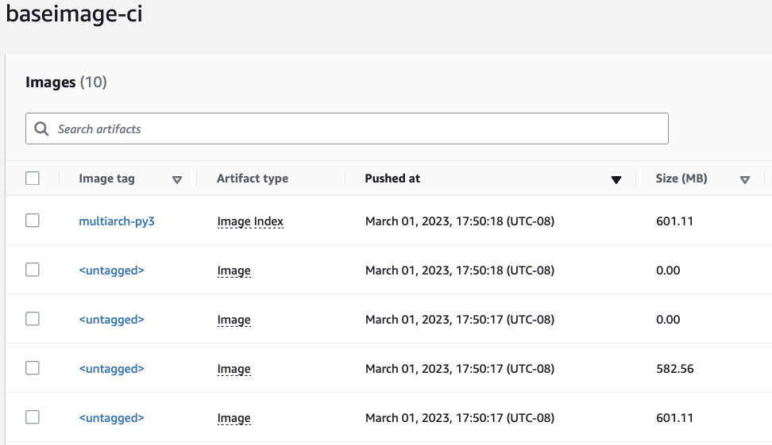

## Build Graviton and Intel-based game server images continuously

[AWS Developer Tools](https://aws.amazon.com/codepipeline/), [EKS](https://aws.amazon.com/eks/), and [Docker](https://www.docker.com) simplify integrating dedicated game server. Dedicated game servers require the game assets, binaries and management tools to be hosted on the same host that runs the game server, so they must be copied for each game server instance. Also, game assets and binaries can add up to gigabytes, slowing down game server initialization time. Causing players to wait and racking up expensive data transfer costs from the build system to the host that runs the server. 

The game server image size doubles when adding support for more processor types like [AWS Graviton processors](https://aws.amazon.com/ec2/graviton/), [Intel Xeon](https://aws.amazon.com/intel/) or [AMD EPYC processors](https://aws.amazon.com/ec2/amd/). Each processor type requires its own intergated game image. 

Furthermore, the game server components are owned by different teams which requires extra coordination during the game integration phase. For example, asset artists create graphics, 3D models, sound effects and music that might be required for the game binary compilation owned by the game developers. The game devops need the game binary to integrate it with an orchestration platform that matches players. 

In this sample we show how to minimize game integration time and costly data transfer between the build and the hosting systems. This example shows how we reduce the images size by 75%, 9.2 GB for both processor types (4.6 GB each) to 2.3 GB needed to be pulled by Kubernetes in the game server initilazation time. We do this by building images that support Intel and Graviton instances. We consider three main personas: artists, developers and devops. 

The artist manages the game assets and pushes them to the build system. The developer codes, tests the game and pushes their changes to the build system. Finally, devops implements SDK such as Agones on top of the game code and releases it the changes to the build system.

We use [Supertuxkart](https://supertuxkart.net/), a 3D open-source arcade racer with a variety of characters, tracks, and modes to play to demonstrate the game image integration process. We deploy separate integration pipelines for artists, developers and devops. This allows them to operate orthogannly and produce a single image that runs on any instance type that fits the game's needs. Each phase is controlled by a GIT repository that triggers the build phase upon pushing a new phase configuration. 

First pipeline owned by devops and it creates the base-image for the game hosting. Our example uses the [Python3.9](https://hub.docker.com/_/python) loaded on Amazon Linux-based image that supports ARM64v8 and AMD64 processor types. To utilize Docker image layer caching, the base-image build process installs the required packages such as the C++ compiler and network tools in the initial integration phase.  

The next pipeline is owned by the artists. It assumes the artist uses asset management tools and it copies the 1.4GB assets files to storage services such as SVN or S3. The artist pipeline pulls the assets files from S3, splits them into layers that are cached per CPU architecture. Game assets can be pulled dynamically during the next phase if they're not big. 

The third pipeline handles game binary compilation and linkage into a single executable. It uses the compiler and packages installed in the first stage and the assets that are referenced in the code for the build process.  

The last integration phase includes game management tools that connect with the game orchestration layer Agones that maintains the game server health, controll the player connectivity and more. 

### Automated image deploy steps
The following will create a CodePipline that copy the build scripts in `server/` folder into a CodeCommit repository and run the steps above in a separate CodeBuild jobs.

1/ deploy the pipeline that creates the base image

```bash
./deploy-base-pipeline.sh
```

2/ deploy the pipeline that creates the stk image game

```bash
./deploy-stk-pipeline.sh
```

#### Base-image Pipeline

The Source stage includes the [code and config](./server/base-image-multiarch-python3/). Note the [Dockerfile](./server/base-image-multiarch-python3/Dockerfile) includes no processor architecture specific so the libraries and packages linked dynamically via the packaged tools e.g., `apt` or `yum`


The resulted images of the base-image pipeline are two images: a 601.11 MB (AMD64) and 582.56 MB (ARM64) docker images. 


#### Game Artist Pipeline

The source stage includes the [code and config](./server/stk-assets-image-multiarch/). Note the build process pulls six assets files from S3 (256MB each) and copy to `/stk-assets` sub-directory. The Dockerfile pre-processed with `envsubst` command for setting the enviroment variables. 


The resulted image of the developer pipeline are two images, `stk-assets-amd` 4637.98 for AMD64 and `stk-assets-arm` 4637.43 for ARM64 and Image Index. 


#### Game Developer Pipeline

The source stage includes the [code and config](./server/stk-code-image-multiarch/). 


We first copy the assets folder from the previous step.

```bash
FROM stk_base AS stk_code
	COPY --from=1 /stk-assets /stk-assets
```

Then we pull the code from a separate Git repository that compatible with the assets (`GITHUB_STK` and `GITHUB_STK_BRANCH`)

```bash
RUN git clone $GITHUB_STK stk-code --branch $GITHUB_STK_BRANCH && \
	    cd stk-code && \
	    mkdir cmake_build && \
	    cmake ../stk-code -B ./cmake_build -DSERVER_ONLY=ON && \
	    cd cmake_build && \
	    make -j$(nproc) -f ./Makefile install
```

The pipeline includes two identical build actions that runs on [ARM64](https://github.com/aws-samples/containerized-game-servers/blob/master/supertuxkart/stk-pipeline-stack.ts#L283) and [AMD64](https://github.com/aws-samples/containerized-game-servers/blob/master/supertuxkart/stk-pipeline-stack.ts#L318) instances. The third build action assembles the two images into a docker image index (manifest) by the [assemble_multiarch_image.sh](./server/stk-code-multiarch/assemble_multiarch_image.sh)

The resulted image of the developer pipeline are two images, `stk-code-amd` 3074.09 for AMD64 and `stk-code-arm` 3054.94 for ARM64 and Image Index. 


#### Game Devops Pipeline

The source stage includes the [code and config](./server/stk-game-server-image-multiarch/). 


Note that this step pulls only the compiled code produced by the game developer pipeline and the assets from the game artist pipeline.

```bash
FROM stk_base AS stk_game
COPY --from=1 /stk-assets /stk-assets
COPY --from=2 /stk-code /stk-code
```

and add to oit the [STK Agones SDK implementation](./server/stk-game-server-image-multiarch/). Like in previous steps, it runs two separete `docker build` jobs (2360.44 MB for AMD64 and 2341.56 MB for ARM64) that are assembled into a docker index image, `stk-server-multiarch`. 


Note that each pipeline phase is optimized for storage to avoid long replication time to the cluster. 

#### Speed up the build pipeline with Docker cache

We present two cache methods to speed up the Docker build process. The first uses the codebuild cache with config in the codebuild project.

```bash
cache: codebuild.Cache.local(codebuild.LocalCacheMode.DOCKER_LAYER, codebuild.LocalCacheMode.CUSTOM),
```


The build trace `Using cache` indicates the layer was pulled from the cache.

```
Step 1/12 : FROM 441218111557.dkr.ecr.us-west-2.amazonaws.com/baseimage-ci:multiarch-py3
57	 ---> 1dca65764d2c
58	Step 2/12 : ARG S3_STK_ASSETS
59	 ---> Using cache
60	 ---> 3de95508358e
61	Step 3/12 : ENV S3_STK_ASSETS=supertuxkart-assets
62	 ---> Using cache
63	 ---> b5d531078804
64	Step 4/12 : RUN wget "https://"supertuxkart-assets".s3.us-west-2.amazonaws.com/stk-assets.part-aa"
65	 ---> Using cache
66	 ---> 9612b982672c
67	Step 5/12 : RUN wget "https://"supertuxkart-assets".s3.us-west-2.amazonaws.com/stk-assets.part-ab"
68	 ---> Using cache
69	 ---> 10bdfb4b12b7
70	Step 6/12 : RUN wget "https://"supertuxkart-assets".s3.us-west-2.amazonaws.com/stk-assets.part-ac"
71	 ---> Using cache
72	 ---> ac4eb80e39be
73	Step 7/12 : RUN wget "https://"supertuxkart-assets".s3.us-west-2.amazonaws.com/stk-assets.part-ad"
74	 ---> Using cache
75	 ---> 1d87a5ea76e5
76	Step 8/12 : RUN wget "https://"supertuxkart-assets".s3.us-west-2.amazonaws.com/stk-assets.part-ae"
77	 ---> Using cache
78	 ---> 9daf03a9bc94
79	Step 9/12 : RUN wget "https://"supertuxkart-assets".s3.us-west-2.amazonaws.com/stk-assets.part-af"
80	 ---> Using cache
81	 ---> 05a91ebcb4a9
82	Step 10/12 : RUN cat stk-assets.part-a* > stk-assets.tar.gz
83	 ---> Using cache
84	 ---> 74bf08a16c6d
85	Step 11/12 : RUN tar -xf stk-assets.tar.gz
86	 ---> Using cache
87	 ---> 2671ee9eb8a1
88	Step 12/12 : RUN ls /stk-assets/
89	 ---> Using cache
90	 ---> ef717334a5a0
```

Also, the build trace `Layer already exists` indicates the cached layers were not copied back to the ECR image repostiory. 

```
9256cdb0e253: Layer already exists
154	509a8c452b6a: Layer already exists
155	2286c449cab8: Layer already exists
156	08e4f09959d1: Layer already exists
157	4daf89f67002: Layer already exists
158	769d65e3d9d4: Layer already exists
159	91b2626f172c: Layer already exists
160	7591b974625f: Layer already exists
161	0b582f264880: Layer already exists
162	2f5d8c42cfc2: Layer already exists
163	2f89e21b7e94: Layer already exists
175	85158601c190: Layer already exists
176	28fa86444e63: Layer already exists
177	0baa05faf31a: Layer already exists
178	0cdca02a73c8: Layer already exists
179	52ebb9a789db: Layer already exists
180	ac504d030134: Layer already exists
181	86d774dafc20: Layer already exists
182	cf2e8433dbf2: Layer already exists
183	da68f13652fc: Layer already exists
```


This option cuts the next assets Docker image build time by 74%, from 5.5 minutes to 1.45 min when utilizing full cache. 

The second caches the images to ECR as an external cache with [buildx](https://github.com/docker/buildx/blob/master/docs/reference/buildx_build.md#-export-build-cache-to-an-external-cache-destination---cache-to) to speed up the build process. 

The buildx toolkit requires specifying the cache destination and mode e.g.,

```bash

--cache-to type=inline --cache-from type=registry,mode=max,ref=$GAME_ECR_REPO

```

To write the cache metadata into the image configuration ('inline') and export layers for all stages (`mode=max`). This option cuts the next assets Docker image build time by 95% from 8 min to 21 sec. The reason buildx initial buildx took 8 min was the buildx emulator option that was acceptable in the case of just copying files in the build process. Note the `linux/amd64` and `linux/arm64` build traces that indicates the specific platform being built.  


```
#9 importing cache manifest from 441218111557.dkr.ecr.us-west-2.amazonaws.com/stk-ci:stk-assets-multiarch
920	#9 DONE 0.5s
921	
922	#10 [linux/amd64  3/10] RUN wget "https://"supertuxkart-assets".s3.us-west-2.amazonaws.com/stk-assets.part-ab"
923	#10 CACHED
924	
925	#11 [linux/amd64  2/10] RUN wget "https://"supertuxkart-assets".s3.us-west-2.amazonaws.com/stk-assets.part-aa"
926	#11 CACHED
927	
928	#12 [linux/amd64  6/10] RUN wget "https://"supertuxkart-assets".s3.us-west-2.amazonaws.com/stk-assets.part-ae"
929	#12 CACHED
930	
931	#13 [linux/amd64  9/10] RUN tar -xf stk-assets.tar.gz
932	#13 CACHED
933	
934	#14 [linux/amd64  8/10] RUN cat stk-assets.part-a* > stk-assets.tar.gz
935	#14 CACHED
936	
937	#15 [linux/amd64  4/10] RUN wget "https://"supertuxkart-assets".s3.us-west-2.amazonaws.com/stk-assets.part-ac"
938	#15 CACHED
939	
940	#16 [linux/amd64  7/10] RUN wget "https://"supertuxkart-assets".s3.us-west-2.amazonaws.com/stk-assets.part-af"
941	#16 CACHED
942	
943	#17 [linux/amd64  5/10] RUN wget "https://"supertuxkart-assets".s3.us-west-2.amazonaws.com/stk-assets.part-ad"
944	#17 CACHED
945	
946	#18 [linux/arm64  4/10] RUN wget "https://"supertuxkart-assets".s3.us-west-2.amazonaws.com/stk-assets.part-ac"
947	#18 CACHED
```
 
