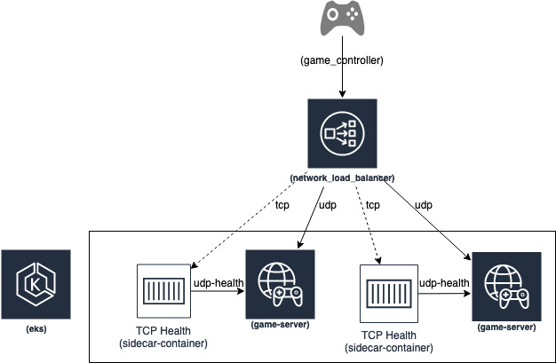

# Deploy highly availible UDP containerized game servers on EKS using NLB

In this project we will demonstrate how to deploy a connectionless (UDP) multiplayer online game server, leveraging Amazon Elastic Kubernetes Service (EKS) (https://docs.aws.amazon.com/eks/latest/userguide/what-is-eks.html), AWS Load Balancer Controller (https://kubernetes-sigs.github.io/aws-load-balancer-controller/v2.3/), and AWS Network Load Balancer (NLB) (https://docs.aws.amazon.com/elasticloadbalancing/latest/network/introduction.html). Additionally, you will learn how to enable and configure TCP health checks when running a connectionless UDP gaming server behind a load balancer. You can use this approach to deploy any connectionless IoT, streaming, media transfer, or native UDP applications behind a Network Load Balancer benefiting from its low latency, scale, and reliability.

The architecture used to deploy a sample connectionless UDP based game server is comprised of the following components:

* Amazon EKS cluster (https://docs.aws.amazon.com/eks/latest/userguide/create-cluster.html)and a node group (https://docs.aws.amazon.com/eks/latest/userguide/create-managed-node-group.html) of Amazon EC2 C6g instances powered by Arm-based Amazon Web services Graviton2 processors.
* AWS Load Balancer Controller (https://docs.aws.amazon.com/eks/latest/userguide/aws-load-balancer-controller.html) that manages AWS Elastic Load Balancers for a Kubernetes cluster.
* A UDP game server (https://github.com/aws-samples/containerized-game-servers/tree/master/udp-nlb-sample) deployed to EKS, a service of type LoadBalancer. The game server also includes udp-health-probe (https://github.com/aws-samples/containerized-game-servers/blob/master/udp-nlb-sample/stk/udp-health-probe.py) used as liveness probe.
* An nginx container deployed as a sidecar along side game server and exposes port 80 which is used for target health check.
* A Network Load Balancer provisioned via in cluster AWS Load Balancer Controller with a UDP listener that is associated with single target group. This target group is configured to register its targets using IP mode and perform health checks on its targets using TCP protocol.
* A udp-health-probe (https://github.com/aws-samples/containerized-game-servers/blob/master/udp-nlb-sample/stk/udp-health-probe.py) allows checking for the state of the UDP game server. When detected any issues with game server, shuts down the nginx service and hence allowing health check (port 80) on a target group to failover to a healthy UDP game server. 



This project uses [supertuxkart](../supertuxkart) as a UDP game server and deploy it to EKS in highly-availible mode. It uses NLB UDP IPv4 support. NLB supports UDP but requires the [target group](https://docs.aws.amazon.com/elasticloadbalancing/latest/network/load-balancer-target-groups.html) health check to use TCP which requires the game publisher to add TCP endpoint in the game server container and reconcile the UDP socket server health with the TCP endpoint. This example simplifies this part by:

* Deploy EKS cluster using [eksctl](https://eksctl.io)
```bash
eksctl create cluster -f eks-arm64-cluster-spec.yaml
```

* Deploy the [aws-load-balancer-controller](https://docs.aws.amazon.com/eks/latest/userguide/aws-load-balancer-controller.html)

* Deploy the [Amazon VPC CNI](https://docs.aws.amazon.com/eks/latest/userguide/managing-vpc-cni.html)

* [udp-health-probe](https://github.com/aws-samples/containerized-game-servers/blob/master/udp-nlb-sample/stk/udp-health-probe.py) that test the UDP socket server health. 

The udp-health-probe logic, check the UDP connection
```python
addr=enet.Address(udp_socket_ip,udp_socket_port)
peer = host.connect(addr,1)
if peer:
    print("%s:" % peer)
    event = host.service(1000)
```
and if the conncetion fails (`enet.EVENT_TYPE_DISCONNECT`) then, the nginx service is stopped  

```python
if event.type == enet.EVENT_TYPE_CONNECT:
        print("%s: CONNECT" % event.peer.address)
    elif event.type == enet.EVENT_TYPE_DISCONNECT:
        print("%s: DISCONNECT" % event.peer.address)
        os.system("service nginx stop")
```
that will cause the `readinessProbe` and the target group check to failover to a healthy game-server.

* The project offers two deployment methods of the side-car TCP server. The first uses [static sidecar container](./nginx-static-sidecar), the second, [nginx-inject-sidecar](./nginx-inject-sidecar), deploys TCP endpoint as a sidecar prior to the game-server pod object by using [MutatingAdminssionWebhook](https://kubernetes.io/docs/admin/admission-controllers/#mutatingadmissionwebhook-beta-in-19)

* The NLB is deployed using the aws-loadbalancer webhook mutation per the k8s game server [annotations](https://kubernetes-sigs.github.io/aws-load-balancer-controller/v2.2/guide/ingress/annotations/). 

The annotation `service.beta.kubernetes.io/aws-load-balancer-type: "external"` indicates the load-balancer is NLB, 
The annotation `service.beta.kubernetes.io/aws-load-balancer-nlb-target-type: "ip"` indicates the nlb target type to use is the pod ip, hence the Amazon VPC CNI. 
The annotations `service.beta.kubernetes.io/aws-load-balancer-healthcheck-port` and `service.beta.kubernetes.io/aws-load-balancer-healthcheck-protocol` specifies the TCP health check, the nginx sidecar discussed below. 
The annotation `service.beta.kubernetes.io/aws-load-balancer-scheme: internet-facing` indicates the NLB endpoint to be public for players to play

```yaml
apiVersion: v1
kind: Service
metadata:
  name: stk-arm-svc1
  annotations:
    service.beta.kubernetes.io/aws-load-balancer-type: "external"
    service.beta.kubernetes.io/aws-load-balancer-nlb-target-type: "ip"
    service.beta.kubernetes.io/aws-load-balancer-healthcheck-port: "80"
    service.beta.kubernetes.io/aws-load-balancer-healthcheck-protocol: TCP
    service.beta.kubernetes.io/aws-load-balancer-scheme: internet-facing
spec:
  selector:
    app: stkarm
  ports:
    - protocol: UDP
      port: 8081
      targetPort: 8081
  type: LoadBalancer
```

### Try it yourself

#### Prerequisites

* An AWS account with admin privileges: For this blog, we will assume you already have an AWS account with admin privileges.

* Command line tools: Mac/Linux users need to install the latest version of AWS CLI (https://docs.aws.amazon.com/cli/latest/userguide/cli-chap-install.html), aws-iam-authenticator, kubectl (https://docs.aws.amazon.com/eks/latest/userguide/install-kubectl.html), eksctl (https://docs.aws.amazon.com/eks/latest/userguide/getting-started-eksctl.html), and git (https://git-scm.com/book/en/v2/Getting-Started-Installing-Git) on their workstation. Whereas Windows users might want to Cloud9 environment (https://docs.aws.amazon.com/cloud9/latest/user-guide/create-environment-main.html) in AWS and then install these CLIs inside their Cloud9 environment.

* To get started with the game server install, clone thecontainerized-game-servers (https://github.com/aws-samples/containerized-game-servers/) github repository on your local workstation.

#### Publish Application Images

As part of this step, you will build and publish the game server and sidecar nginx container images to Amazon Elastic Container Registry (Amazon ECR). Locate udp-nlb-sample directory in the local folder where you recently cloned containerized-game-servers (https://github.com/aws-samples/containerized-game-servers/) repo into.  

```bash
cd containerized-game-servers/udp-nlb-sample
```

Enter the following command to set environment variables AWS Region and AWS Account ID.

```bash
export AWS_ACCOUNT_ID=$(aws sts get-caller-identity --output text --query Account)
export AWS_REGION=us-west-2
```

#### Build and Publish Game Server Image
The next step is to build a docker image of a game server and publish it to the ECR repository. This step creates ARM-based images. 

The buildx (https://docs.docker.com/engine/reference/commandline/buildx/) CLI plug-in for Docker simplifies the process of creating multi-arch images. If you're running Docker Desktop (https://www.docker.com/products/docker-desktop) >= 2.1.0, for example on Mac OSX or Windows, it comes configured with buildx and all the necessary functionality for cross platform image building. However, if you're running on a system that lacks Docker Desktop support, such as a Cloud9 instance, you'll need to install it manually. You may install buildx on Amazon Linux2 EC2 instances by following the steps detailed here (https://aws.amazon.com/blogs/compute/how-to-quickly-setup-an-experimental-environment-to-run-containers-on-x86-and-aws-graviton2-based-amazon-ec2-instances-effort-to-port-a-container-based-application-from-x86-to-graviton2/).

```bash
cd containerized-game-servers/udp-nlb-sample/stk
sh ecr-repos.sh
sh build.sh
```

#### Build and Publish Sidecar Image
We are running nginx as a sidecar container alongside the game server to support TCP target health checks used by the Network Load Balancer Controller. We will publish an ARM-based nginx image to the ECR repository. 

```bash
cd containerized-game-servers/udp-nlb-sample/nginx-static-sidecar/
sh ecr-repos.sh
sh build.sh
```

#### Create EKS Cluster
Use eksctl to create a cluster. Make sure you are using the latest version (https://docs.aws.amazon.com/eks/latest/userguide/eksctl.html) of eksctl for this example. Cluster add-ons such as VPC CNI, Core DNS, and kube-proxy are deployed using the cluster specification file. Additionally, the following command creates managed node group of instances powered by Arm-based AWS Graviton3 processors.

```bash
eksctl create cluster -f eks-arm64-cluster-spec.yaml
```

#### Deploy AWS Load Balancer Controller
AWS Load Balancer Controller is responsible for the management of AWS Elastic Load Balancers in a Kubernetes cluster. To deploy an AWS Load Balancer Controller, follow the steps outlined in the EKS user guide (https://docs.aws.amazon.com/eks/latest/userguide/aws-load-balancer-controller.html).

#### Deploy Game Server
The sample game server is configured as a service type of LoadBalancer. When deployed, the AWS Load Balancer Controller (https://kubernetes-sigs.github.io/aws-load-balancer-controller/v2.3/guide/service/nlb/) will provision an external-facing Network Load Balancer (https://docs.aws.amazon.com/elasticloadbalancing/latest/network/load-balancer-target-groups.html#target-type) with a target type "IP" and a listener protocol "UDP". In this demonstration, we are using AWS VPC CNI (https://docs.aws.amazon.com/eks/latest/userguide/pod-networking.html) for pod networking. The VPC CNI supports direct access to pod IP via secondary IP addresses on an ENI (https://docs.aws.amazon.com/AWSEC2/latest/UserGuide/using-eni.html) of the instance pod is scheduled on. If you are using an alternative CNI, ensure that it supports directly accessible pod IP.

For the purpose of this demonstration, we will use nginx as a sidecar. Sidecars are the containers that should run alongside the pod’s main container. This sidecar pattern extends and enhances the functionality of existing containers without requiring them to be modified. The nginx port is used to work around the Network Load Balancer’s requirement for target TCP only health checks (https://docs.aws.amazon.com/elasticloadbalancing/latest/network/target-group-health-checks.html). The game server and sidecar share the same process namespace (https://kubernetes.io/docs/tasks/configure-pod-container/share-process-namespace/#configure-a-pod). A udp_health_check.py (https://github.com/aws-samples/containerized-game-servers/blob/master/udp-nlb-sample/stk/udp-health-probe.py) script included in this demo checks the game server’s health and sends a SIGKILL signal to the nginx container. Incoming UDP traffic is forwarded to a healthy game server pod when the Network Load Balancer's target health check fails.
 
Make sure the AWS_REGION and AWS_ACCOUNT_ID variables are set correctly.

```bash
cd containerized-game-servers/nginx-static-sidecar/
cat stknlb-static-tcphealth-sidecar.yaml | envsubst | kubectl apply -f -
```

Wait for all the pods to be in running state. 

```bash
kubectl get pods --selector=app=stknlb --watch
```

Take note of the URL (EXTERNAL-IP) for our newly launched gaming server application. You may need to wait a few minutes for the load balancer to be provisioned successfully.

```bash
kubectl get svc stk-nlb-svc
```

#### Test Game Server
You can test the game server on your local workstation by downloading the supertuxkart (https://supertuxkart.net/Download)). Use online mode in supertuxkart and connect to the Network Load Balancer URL recorded in the previous step.

You next navigate to the game lobby by entering the EXTERNAL-IP URL with port 8081. Wait for other players to join, then click Start race to begin the game.

#### Cleanup

To avoid incurring future charges, you can delete all resources created during this exercise. This action, in addition to deleting the cluster, will also delete the node group.

```bash
eksctl delete cluster --name arm-us-west-2
```
